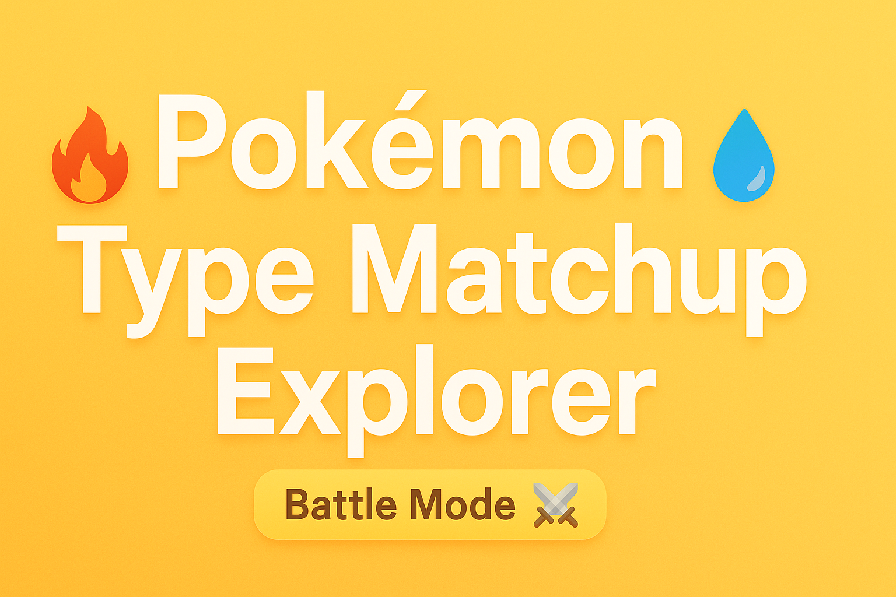
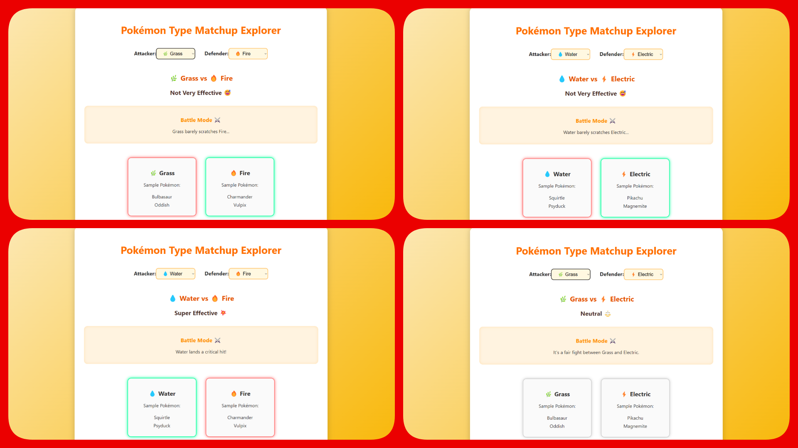

cat > README.md << 'EOF'
# 🎮 Pokémon Type Matchup Explorer  

  

An interactive React app to explore **Pokémon type effectiveness**.  
Choose attacker and defender types, visualize battle outcomes, and enjoy a fun **battle mode simulation** with glowing type cards!  

---

## 📸 Preview  
  

---

## 🧐 Features  
- 🎮 **Type Effectiveness Calculator** — test attacker vs defender matchups  
- ✨ **Glowing Type Cards** — highlight strengths and weaknesses  
- ⚔️ **Battle Mode Simulation** — see fun battle messages  
- 📋 **Sample Pokémon Display** — shows example Pokémon for each type  
- 🎨 **Modern UI** — clean design with smooth animations  

---

## 📂 Project Structure  
\`\`\`
pokematchup-explorer/
 ├── src/                 # React components (App, TypeMatchupExplorer, etc.)
 ├── public/              # Static assets (if any)
 ├── index.html           # Root HTML file
 ├── package.json         # Project metadata & dependencies
 ├── vite.config.js       # Vite configuration
 ├── eslint.config.js     # ESLint setup
 ├── preview.png          # Project preview image
 ├── banner.png           # Project banner image
 └── README.md            # Project documentation
\`\`\`

---

## 🚀 Getting Started  

### 1️⃣ Clone the repository  
\`\`\`bash
git clone https://github.com/Abdullah-Arif-5065/pokematchup-explorer.git
cd pokematchup-explorer
\`\`\`

### 2️⃣ Install dependencies  
\`\`\`bash
npm install
\`\`\`

### 3️⃣ Run the development server  
\`\`\`bash
npm run dev
\`\`\`

---

## 🛠️ Tech Stack  
- ⚛️ React  
- 🎨 CSS3 (custom styles + animations)  
- ⚡ Vite  

---

## 📜 License  
This project is open-source and available under the **MIT License**.  
EOF

git add README.md && \
git commit -m "📝 Updated README with banner and structure" && \
git push origin main
